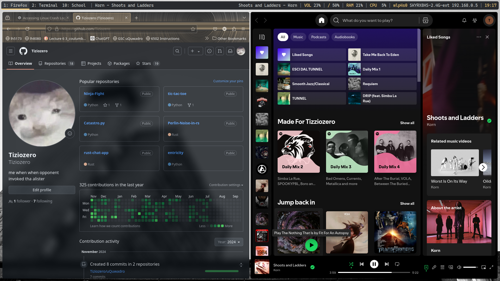

# Linux Environment Setup

This guide outlines the steps and tools needed to replicate a customized Linux environment, featuring a tiling window manager, aesthetic enhancements, development tools, and productivity utilities. The setup includes i3-gaps, Polybar, Alacritty, Neovim, and other customizations.



## Table of Contents
- [Prerequisites](#prerequisites)
- [Installation](#installation)
  - [Window Manager](#window-manager-and-customization)
  - [Fonts](#fonts)
  - [Terminal and Shell](#terminal-and-shell)
  - [Developer Tools](#developer-tools)
  - [Additional Tools](#additionl-tools)
  - [Logitech Device Support](#logitech-device-support)
- [Configuration Files](#configuration-files)
- [Final Steps](#final-steps)

## Prerequisites
Make sure your package manager is up-to-date:
```bash
sudo apt update
```

## Installation

### Window Manager and Customization
- **Sway**: Window manager
```bash
sudo apt install sway swaybar swaybg
```
- **swaylock-effects**: locker, for of swaylock
```bash
git clone https://github.com/mortie/swaylock-effects
cd swaylock-effects
meson build
ninja -C build
sudo ninja -C build install
```
## i3
- **i3-gaps**: Window manager with gaps support
```bash
sudo apt install i3-gaps
```
- **i3lock**: lock environment
```bash
sudo apt install i3lock
```
- **Polybar**: Status Bar
```bash
sudo apt install polybar
```
- **Picom**: Compositor for i3
```bash
sudo apt install picom
```
- **Picom - [Jonaburg fork](https://github.com/jonaburg/picom.git)**: Compositor for i3
```bash
git clone https://github.com/jonaburg/picom.git
cd picom
meson --buildtype=release . build
ninja -C build
sudo ninja -C build install
```
> **NOTE:** Using both Picom and Jonaburg's Picom fork (as picom_fork) because normal Picom causes issues without "--experimental-backends"
- **Ulauncher**: Launcher (with [Kira Dark](https://github.com/Sergio9815/kira-dark-ulauncher) colorscheme)
```bash
sudo add-apt-repository ppa:agornostal/ulauncher
sudo apt update
sudo apt install ulauncher
```
### Fonts
- **Caskaydia Cove**: Font used
```bash
# Step 1: Clone the Repository
git clone https://github.com/eliheuer/caskaydia-cove.git

# Step 2: Navigate to the Downloaded Directory
cd caskaydia-cove

# Step 3: Install the Fonts

# Method 1: Manual Installation (Copy to Local Fonts Folder)
mkdir -p ~/.local/share/fonts  # Create local fonts directory if it doesn't exist
cp ./fonts/ttf/*.ttf ~/.local/share/fonts/  # Copy font files to local directory
fc-cache -fv  # Update font cache

# Method 2: System-wide Installation (Requires Root)
# Uncomment these lines if you prefer a system-wide installation
# sudo cp ./fonts/ttf/*.ttf /usr/local/share/fonts/
# sudo fc-cache -fv

# Step 4: Verify the Installation
fc-list | grep "Caskaydia Cove"  # Check that the font is installed

# Step 5: Use the Font
# Example configuration for Polybar
# font-0 = Caskaydia Cove:size=10

# Example configuration for i3
# font pango:Caskaydia Cove 10
```
also download nerd font from website
### Terminal and Shell
- **Alacritty**: Treminal emulator
```bash
sudo apt install alacritty
```
- **Ghostty**: Treminal emulator
Build from [source](https://github.com/ghostty-org/ghostty.git)
- **Zsh**: Shell
```bash
sudo apt install zsh
chsh -s $(which zsh)        # Changes default shell to Zsh
zsh                         # Start a new Zsh session
```
- **Oh My Zsh**: Zsh Shell plugin manager
```bash
sh -c "$(curl -fsSL https://raw.githubusercontent.com/ohmyzsh/ohmyzsh/master/tools/install.sh)"
```
> **NOTE**: This is NOT included in this repo. Download separatly.

### Developer Tools
- **Neovim**: Text editor
```bash
sudo apt install neovim
```
> **NOTE:** Install cargo, node, build tools to install and build LSPs

### Additionl Tools
- **Additional tooks**: used for playback, screenshots, etc...
```bash
sudo apt install xbacklight redshift flameshot scrot playerctl feh dex alsa-utils xss-lock xautolock lxappearance touchegg
```
> **NOTE**: Install amixer for volume control, xss-lock and xautolock for auto-locking functionality, and lxappearance for customizing themes and icons.

### Logitech Device Support
- **logid**: Logitech device driver daemon
```bash
sudo apt install logid
```
```bash
sudo apt install build-essential cmake pkg-config libevdev-dev libudev-dev libconfig++-dev libglib2.0-dev
git clone https://github.com/PixlOne/logiops.git
cd logiops
mkdir build
cd build
cmake -DCMAKE_BUILD_TYPE=Release ..
make
```
or
- Move the configuration file to system directory:
```bash
sudo cp logid.cfg /etc/
```
> **NOTE**: The logid.cfg file contains device-specific configurations for Logitech devices.

## Configuration Files
To load configurations files, simply donwload repo in your home directory and extract desired files.

## Final Steps
Reboot or something idk.

> **NOTE**: if enything goes wrong: fails to build, wrong pakage names, etc... go on the programs official repo/website and look at the requirements. More often than not it's a missing library.
